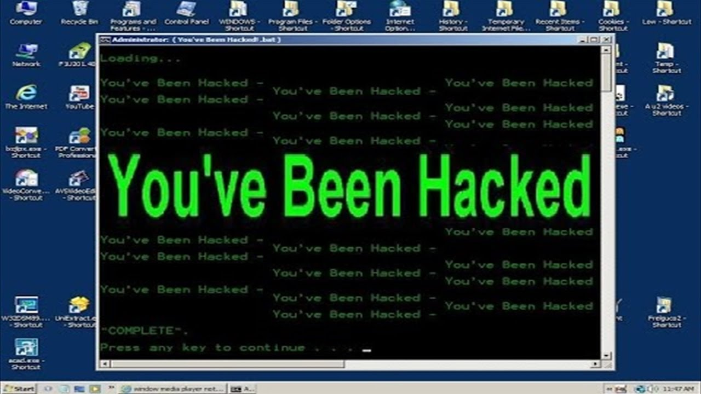

# Day 1

## This is where day 1 begins

We'll insert some content here

## Another slide because why not?

Write content using inline or external Markdown.
Instructions and more info available in the [readme](https://github.com/hakimel/reveal.js#markdown).

```
<section data-markdown>
    ## Markdown support

    Write content using inline or external Markdown.
    Instructions and more info available in the [readme](https://github.com/hakimel/reveal.js#markdown).
</section>
```

# Another topic

## Adding content

Adding content to see how it all works

# Testing separator

## Testing vars

Testing if line separators are needed%{title}

Now testing for missing metavar %{missing} and bad syntax ${author}

## Show off code

``` c
void main() {
    return 1;
}
```

# And now for a picture

## Danger!


