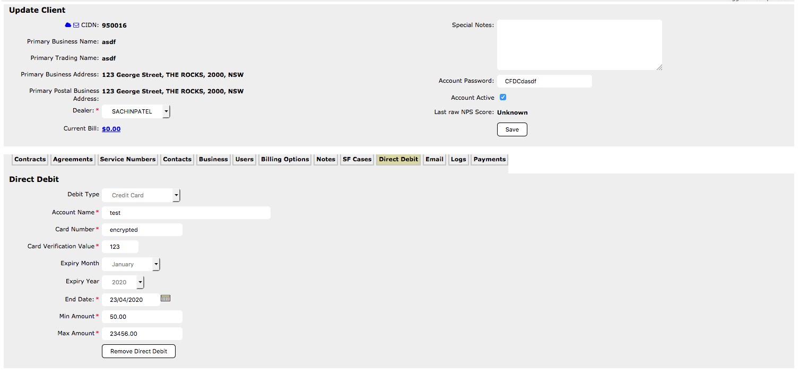

---
v_cc_enc:
    name: Insecure credit card storage and encryption
    rating: High
    num_treatments: '1'
    status: Fixed
...

## %{v_cc_enc.name}{.finding}

| Rating                        | Status             | 
:-------------------------------|:-------------------|
| [%{v_cc_enc.rating}]{.rating} | %{v_cc_enc.status} | 

### Description

The application employs insecure practices to store credit card data, leaving it in breach of of the Payment Card Industry Data Security Standard. If audited and found in breach by one of the credit card brands, %{client} could face considerable fines and penalties.

A static, hard-coded key is used to encrypt credit cards:

```java
  private static byte[] encryptByteArray(byte[] array)
    throws Exception
  {
    byte[] key = "it176CB!7GLa3M0q".getBytes();
    SecretKeySpec desKey = new SecretKeySpec(key, "AES");
    Cipher cipher = Cipher.getInstance("AES");
    cipher.init(1, desKey);
    byte[] encryptedArray = cipher.doFinal(array);
    return encryptedArray;
  }
```

The application appeared to store CVV numbers unencrypted.



These issues are both automatic fails should the organisation be audited against the Payment Card Industry Data Security Standard.

### Treatments
<div class="treatment">
#. Implement a tokenised solution that does not require the storage of credit card details of CVVs.
</div>

BTB have provided working source code snippets for a tokenised solution.

### References

* [Encryption](#### Encryption)
